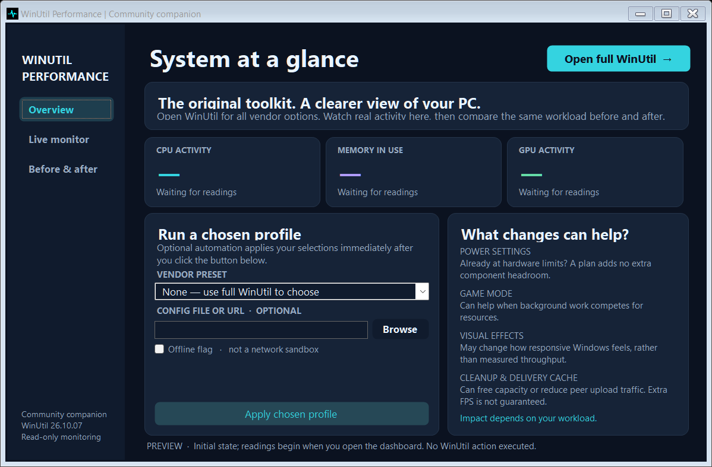
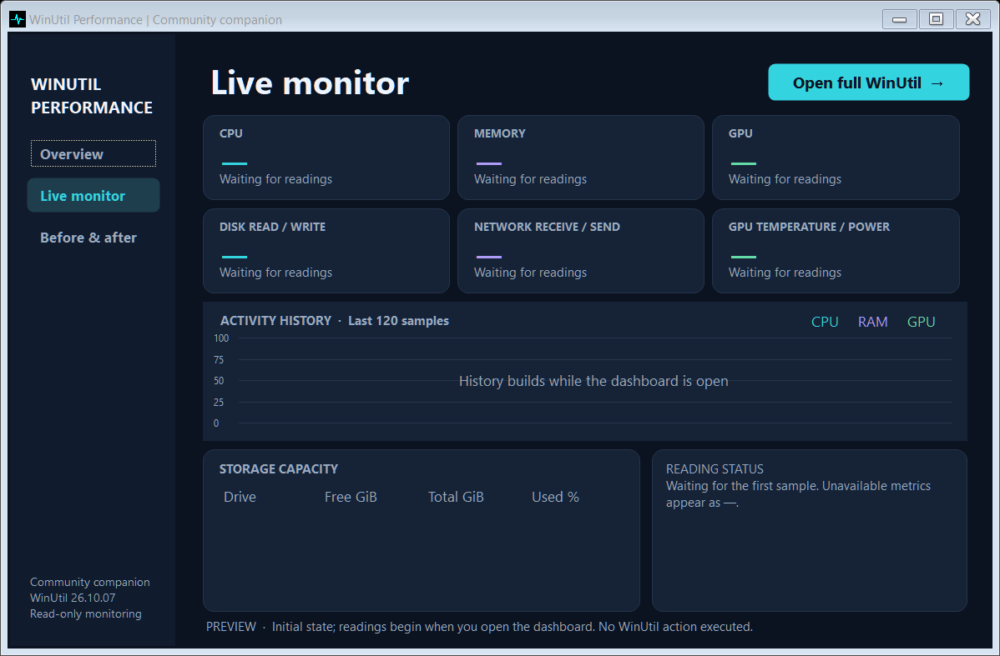
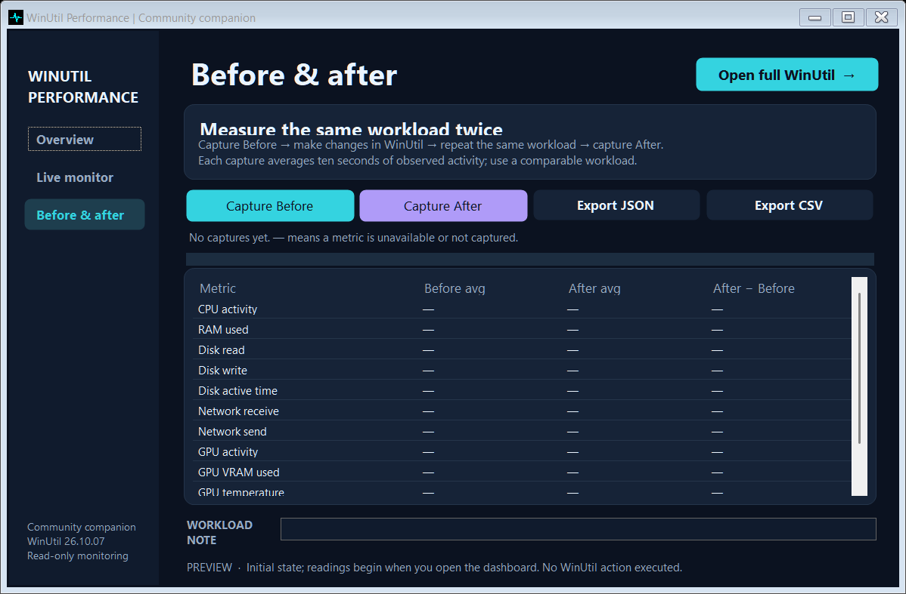

# WinUtil Performance Dashboard

A small Windows companion that brings live performance readings and before-and-after captures alongside the full [Chris Titus Tech WinUtil](https://github.com/ChrisTitusTech/winutil) interface.

Open the dashboard, see what your PC is doing, and launch WinUtil when you want to make changes. Opening the dashboard does not apply an optimization preset.



## What it does

- **Keeps the complete WinUtil interface available.** Open the original Install, Tweaks, Config, Updates, and Win11ISO tools from one button.
- **Shows live readings.** CPU and physical RAM usage, disk activity and transfer rates, network traffic, drive capacity, and supported NVIDIA GPU readings.
- **Makes comparisons easy.** Capture ten-second averages before and after a change, add a workload note, and export the results as JSON or CSV.
- **Supports WinUtil automation.** Select an original preset or supply a configuration file or URL when you already know which changes you want.

The dashboard is portable and uses Windows' built-in .NET Framework and Windows PowerShell. There is no installer or additional monitoring service.

## Download and run

Download **WinUtil-Performance.exe** from the [latest release](https://github.com/Jamesris1/winutil-performance-dashboard/releases/latest), then double-click it. The dashboard runs as your normal user. **Open full WinUtil** and applying a chosen profile request administrator approval through Windows UAC.

Release builds are unsigned. This is an independent companion project, not an official Chris Titus Tech application.

To use individual WinUtil options, select **Open full WinUtil**. For automation, choose a preset or configuration and select **Apply chosen profile**. Automation runs the selected WinUtil operations immediately; presets can contain broader system changes than their names suggest. The **Offline** checkbox passes WinUtil's original flag and does not prevent network access.

## Measure before and after



1. Start the workload you want to compare, and let it settle.
2. In **Before & after**, add a short workload note and select **Capture Before**.
3. Make your changes, then repeat the same workload under similar conditions.
4. Select **Capture After**, review the differences, and export the comparison if you want to keep it.



Each capture averages ten seconds of observed activity. These readings are useful context, not benchmark scores: lower CPU or RAM usage alone does not prove a faster PC. Background downloads, open programs, temperatures, and the workload can all change the result. The app reports measured differences rather than promising a fixed optimization percentage.

| Reading | What is shown |
| --- | --- |
| CPU | System activity as a percentage |
| RAM | Physical memory in use and usable total, in GiB |
| Disk | Read/write rates in MiB/s and active time |
| Network | Receive/send rates in MiB/s across active adapters |
| Storage | Used, free, and total capacity for available drives, in GiB |
| NVIDIA GPU | Activity, VRAM in MiB, temperature, and power when available |

CPU, memory, disk, and network readings update about once per second. GPU readings and drive capacity refresh about every five seconds. The graph retains the latest 120 samples. A dash means that a reading is unavailable or still warming up. Network totals can include virtual adapters, so they may differ from the traffic reported by a router or internet provider.

Monitoring stays local. Captures are saved in your Windows user profile, and JSON and CSV exports are written only where you choose to save them. Exports can include drive labels, adapter descriptions, and your workload note. New installations start without someone else's performance results. The original WinUtil tools may use the internet for their own operations.

## Requirements and build

- Windows with **Windows PowerShell 5.1** and **.NET Framework 4.x**. The build uses the .NET Framework compiler installed with Windows.
- NVIDIA GPU details require an available `nvidia-smi`. Other readings work without it; AMD and Intel GPU details are not currently collected.
- WinUtil operations retain the requirements and behavior of the bundled upstream release.

Clone or download this repository, then run:

```powershell
.\build.ps1
```

The output is `dist\WinUtil-Performance.exe`. The build checks the bundled WinUtil script against its pinned SHA-256 before embedding it. No third-party build packages are needed.

Run `.\tests\check.ps1` for the launcher and argument checks. See [CONTRIBUTING.md](CONTRIBUTING.md) if you want to change the dashboard or collector.

For argument validation and a read-only monitoring check:

```powershell
.\dist\WinUtil-Performance.exe --self-test
.\dist\WinUtil-Performance.exe --telemetry-test
```

Use `--help` for all command-line options. `-Config`, `-Preset`, and `-Offline` are forwarded to WinUtil; supplying a configuration or preset invokes its automation rather than just opening the dashboard.

## Credits and license

WinUtil was created by **Chris Titus Tech and the WinUtil contributors**. This application embeds the unmodified official [WinUtil 26.10.07 release](https://github.com/ChrisTitusTech/winutil/releases/tag/26.10.07), checks its SHA-256, and launches it through Windows PowerShell. The dashboard and monitoring code are separate companion code.

Read the [WinUtil documentation](https://winutil.christitus.com/) for the behavior of its system tools. Please send dashboard or monitoring issues to this repository; upstream WinUtil has its own [issue tracker](https://github.com/ChrisTitusTech/winutil/issues).

The project is MIT licensed. The upstream WinUtil copyright and license are retained in [THIRD-PARTY-NOTICES.md](THIRD-PARTY-NOTICES.md) and [vendor/WINUTIL-LICENSE.txt](vendor/WINUTIL-LICENSE.txt). This project is not affiliated with or endorsed by Chris Titus Tech.
